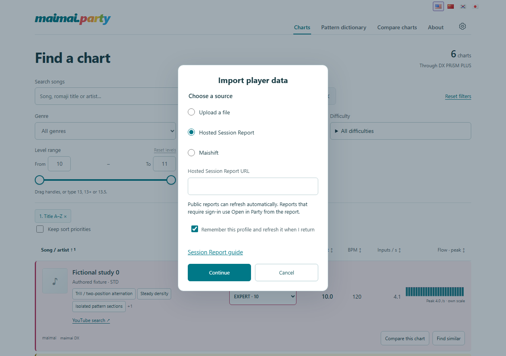
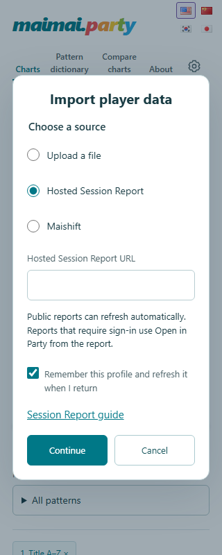

# Player import delivery — 2026-09-21 UTC

The current [general-release plan](PLAYER_IMPORT_RELEASE_PLAN.md) collects the
remaining acceptance gates and the new banner-free import-button proposal. It
is planning/design work; it does not activate the main-site feature.

September 22 UTC: the **unlisted pilot is published**, with Adam's test-page,
$5/month-plus-usage Workers Paid and minimal deployment-permission approvals.
The [hosted release record](MAISHIFT_HOSTED_PILOT_RELEASE.md) preserves the exact
deployment and evidence: 1,719 real sample PBs matched, grades/ratings visible,
remembered restore and unchanged refresh passed, and cross-tab Forget survived
reloads. Existing production content is byte-identical. The complete feature's
general-release gates remain open; earlier local-only statements below describe
their dated validation stages and are superseded by that hosted record.

The independent import, refresh, storage and localization changes are implemented
for review. **The complete Maishift integration remains incomplete and disabled.**
The approved local proxy now verifies extraction and normalization of all 2,010
played PBs returned for the official sample. The reviewed Party chart crosswalk
is now installed locally; source chronology and deployment acceptance remain incomplete. The combined
announcement is consequently unreleased. See [proxy delivery](MAISHIFT_PROXY.md)
for the new code, privacy constraints, validation, and remaining release gates.
The [latest matching research](MAISHIFT_MATCHING_RESEARCH.md) verifies the full
tracks/export agreement in both regions and records unique candidates for every
catalog chart. All exceptional matches are now explicitly reviewed and preserved;
local mapping consumption is implemented and tested as recorded in
[mapping test evidence](MAISHIFT_MAPPING_TESTS.md): all 2,010 International and
200 Japan sample PBs match in Chrome, Edge, Firefox and narrow WebKit. Player source identity uses
the supplied username plus game region, with rename/reuse limits documented in
[the mapping decisions](MAISHIFT_MAPPING_DECISIONS.md). The preview was shortened;
secondary documentation now lives only behind localized source question marks.
The duplicate guide link and Import details disclosure are removed. Initial
region selection and remaining image/chart-rating limitations are recorded in
[the presentation follow-up](IMPORT_SOURCE_PRESENTATION.md).
The [runtime verification](MAISHIFT_RUNTIME_VERIFICATION.md) now also passes both
regions in local workerd, adds bounded output expansion and per-isolate admission,
and separates the remaining upstream chronology and deployed resource gates.
The [invited pilot](MAISHIFT_PILOT.md) is now built as a separate unlisted page
and deployment artifact. Its baseline/upload/stability sequence collects the
missing evidence without writing experimental data into saved Party history.
It is now published as a pilot and does not enable the normal import or announcement.

## Actual chart browser pilot and import presentation — September 21

The pilot now includes `/pilot/maishift/browser/`, using Party's actual chart
browser and import pipeline. Its saved dataset, temporary import, cross-tab
notifications and filter/group preferences use a separate pilot namespace.
The main-site Maishift capability and announcement remain disabled. The browser
pilot omits analytics, announcement and payment scripts. File/report imports,
remembered refresh, corrections, cross-tab Forget and source-switch cancellation
remain part of the same tested pipeline. No Session Report pin or portable v1
schema changed, so no downstream pinned-library update was required.

Published filter changes (#39) and the MAGiCAL logo (#40) were fetched and merged
from `origin/main` at `e2ee969`, integrated locally as `f9dd8a9`. All 25 incoming
files matched their preserved pre-merge working copies afterward. The scoped
stash remains available. Unrelated retention tooling, artwork and badge work was
preserved and excluded from these changes.

The import menu question mark moved into the popup: one shared help link for
the grouped file/report options, and one for Maishift. Both open the corresponding
section of a locally bundled README in English, Simplified Chinese, Korean or
Japanese. The compact radio rows use Party's favicon and the verified Maishift
favicon. Explicit regional URLs select International/Japan without a request;
bare names retain the region choice. North America uses the International player
record set. See [presentation and source evidence](IMPORT_SOURCE_PRESENTATION.md).

Maishift's verified integer total profile rating now appears in the official
badge, in both import preview and Settings. Optional display metadata is stored
beside the dataset, including temporary imports; it never changes the portable
format or creates history. Missing values and per-chart fractional ratings remain
unknown. A real-source browser preview again showed 1,719 PBs and the reported
total rating. The user-approved source was imported once into the isolated local
test tab; no raw score artifact or real-player screenshot was retained.

The build uses registry inventory, with exact mappings and the latest version
logo. Jackets and the retained transcription/pattern/Flow package are not included;
their placeholders/unavailable sections are an explicit current pilot limitation.
The upload-check surface is still available separately for genuine before/after
evidence. This browser pilot does not establish genuine upload chronology,
deployed-origin access or operational limits, and does not complete general release.

Validation after the presentation/rating changes:

| Check | Result | DevCache workspace |
| --- | --- | --- |
| Python wrapper | 525 tests, OK, 7 skipped | `20260921T214627710-82771ce7` |
| Worker wrapper and binding generation | 34 passed | `20260921T214628436-399df369` |
| Complete player browser matrix | 376 passed | `20260921T214628481-394c39a2` |
| Localization, JS copy inventory and review fingerprints | Passed, 919 messages | Canonical source with DevCache tools |

The matrix covers Chrome, Edge, Firefox and WebKit plus desktop/mobile/320px,
all four languages, actual built catalog overlays, main-site storage isolation,
restoration, unknown/known rating, rating-only refresh without new history,
corrections, hidden results, unchanged filter selection, delayed responses,
cross-tab Forget, newer file imports and private/login/throttled/oversized inputs.
The source-side badge padding was subsequently tightened and focused final-tree
validation is recorded below. Fictional screenshots are under the browser
workspace's `tests/browser/test-results/player-maishift-browser-*` directories.

Final focused browser validation passed 70 checks in
`20260921T215039549-3f7f8533`, including the final profile-card padding and
provider-specific metadata guard. That workspace's
`output/browser-tests/maishift-pilot` is the exact artifact served locally on
port 8896. Its upload-check fingerprint is
`cbeb35315994ff79ee9589f14c6b890363b57e9b429e803e07d7368d7c3d6ca2`;
browser fingerprint is
`7eafc35b498f9bff2a46b3d3f641e2fa021e7874b9d14b95fd6d4ba293c8456f`.
The gateway verifies every manifest file at startup. No live deployment occurred.

Staged-only export `browser-pilot-staged-20260921T215810037` passed its three
artifact tests and produced the identical manifest and file digests. Text asset
packaging now normalizes LF/CRLF so checkout line endings cannot change release
fingerprints. The resulting artifact passed another 70 browser checks in
`20260921T215758224-73df5b60`; it is byte-identical to the artifact served above.
Final style checks passed; the subsequent helper-only line wrap was confirmed
to preserve its parsed Python program. Changes are staged for review, with the
unrelated working-tree files and preservation stash left intact.

During the final check, additional unstaged genre/availability work appeared in
`challenge-review.html`, `challenge-review.js`, `chart-filters.css`, `lab-loader.js`,
`registry-browser.js` and `registry_catalog.py`. It is preserved, not included in
the staged pilot or its tested artifact, and is distinct from the published
filter/MAGiCAL changes already merged above.

Settings keyboard/accessibility and analytics privacy regression checks then
passed 22 tests, with three opt-in live checks skipped, in
`20260921T215332042-4aa2c5b7`. An earlier run collided with the other test server;
the sequential rerun exposed one test that still expected the removed help-menu
item. Its expected keyboard sequence was updated, and the complete selected
suite passed. No assertions were suppressed and no live analytics audit was run.

## Earlier local preview repair and real-account baseline — September 21

The initial loopback preview was a static server: its API POST returned 501.
The replacement `tools/Start-MaishiftPilot.ps1` serves the verified artifact and
the existing bounded reader locally, restricted to the expressly selected public
username/region. It validates local Host/Origin, denies credentials/arbitrary
URLs, shares cooldown/attempt limits across tabs and never publishes a route.
The page now states that this preview is local-only. Production origin validation
and disabled release/announcement flags remain unchanged.

The supplied profile-root URL is now accepted, consistent with the observed
redirect to `/home`. A user-selected Japan read returned International (`ASIA`)
metadata; this mismatch now has an explicit localized error and still stops
before fetching tracks. A subsequent International baseline was verified in the
user's visible browser: **1,719 played PBs, 1,719 exact matches, zero unmatched,
zero excluded**. No actual score payload, profile identifier or real-account
screenshot was retained in repository artifacts. This does not verify genuine
changed uploads, snapshot atomicity or deployed Cloudflare operation.

The active preview artifact is DevCache workspace
`pilot-preview-20260921T205248260-29ee9adb`, build
`27bc2d01233e810decaf64b2e84a1479154a7dc81020827c8df82be9db18f64f`.
This supersedes the initial pilot artifact below for the repaired UI/adapter.
Worker/local-preview checks: **31 passed**, workspace
`20260921T205444596-8cab72ba`. Existing Maishift import/refresh/Forget checks:
**112 passed**, in `20260921T205443981-8b327332`. The accompanying pilot matrix
initially reported 28 test failures because its clipping assertion treated normal
scrolling of a long URL inside a native input as overflow. The corrected check
retains URL-value, field-boundary and button/select-label assertions. The complete
final pilot matrix then passed **42 tests**, including translated region errors
at 320px, in `20260921T205701075-7e7cb25e`. Localization coverage/inventory/review
checks pass with 53 pilot entries. No shared-library/Session Report pin changed.
Hosted deployment, genuine update/correction/version evidence, operating-limit
acceptance and general release remain incomplete; other checkout work is separate.

## Hosted pilot preparation — September 21

The tester's explicit choice is a hosted pilot for a few invited players. The
prepared scope is `/pilot/maishift/` plus the existing isolated Maishift proxy.
This remains a public unlisted link, not an invitation access restriction.
Deployment, invitations, account configuration, genuine account trials and live
workflow dispatch remain separate owner actions. No live account was fetched in
this preparation pass. See the [pilot guide](MAISHIFT_PILOT.md) for tester steps,
aggregate report fields, deployment merge/rollback instructions and release gaps.

Final artifact:
`C:\DevCache\projects\maimai-chart-browser-registry\6c15e789d6fd4518\workspaces\pilot-artifact-20260921T202953458-bf9f763b`.
Pilot build fingerprint:
`4eea6ebaea4a7ae236c52b5d2ec780f9c3a1b494f95766f6aaa39ac1f6e59963`.
The manifest hashes all pilot assets and the proposed path-scoped headers. Do not
deploy this directory as the whole site or overwrite existing site headers.

| Final check | Result | DevCache workspace |
| --- | --- | --- |
| Python development wrapper | 525 tests, OK, 7 skipped | `20260921T202506955-adfeac34` |
| Worker development wrapper and binding generation | 24 passed | `20260921T202508586-82f3f138` |
| Pilot browser development wrapper | 42 passed in all seven configurations | `20260921T202915607-5a05a997` |
| Localization copy, JS inventory and review fingerprints | Passed; 51 new pilot entries, 910 total in current working tree | Canonical source and DevCache dependencies |
| Pilot Python style checks and hosted checker syntax | Passed | Canonical source, DevCache tools |

The Python/Worker checks used the same final logic; the final browser pass also
verifies the subsequent language-button sizing change. An earlier pilot run had
one Firefox context-teardown protocol error; its clean retry and final complete
matrix passed without suppressing assertions. Tests use fictional profiles, the
actual Worker contract and browser adapter. No hosted or genuine-upload result
is claimed. The separate owner-run hosted smoke script requires an approved
canary and the reviewed build fingerprint.

Fictional desktop and 320px screenshots were visually reviewed in the final
browser workspace under `tests/browser/test-results/`, in the
`player-maishift-pilot-host-e8c08-dence-and-no-player-storage-desktop` and
`player-maishift-pilot-host-e8c08-dence-and-no-player-storage-narrow` directories
(each named `maishift-pilot.png`). Test outputs remain in DevCache.

The pilot reuses exact mappings and the strict v1 adapter but intentionally does
not test saved real-account imports, remembered refresh or cross-tab Forget.
Their existing deterministic evidence remains below; deployed real-account
acceptance is still required. The shared library and Session Report pin are
unchanged. Concurrent filter/artwork/other localization changes remain separate.

The exact staged tree was separately exported to DevCache workspace
`pilot-staged-20260921T203302434`: its 15 focused Python tests, eight pilot contract
tests, style checks and localization checks passed (900 staged messages, excluding
ten messages from concurrent work). All ten deployable artifact files match that
tree after normalizing checkout line endings and the resulting build fingerprint.
The supplied artifact's literal hashes were also verified against its manifest.

## Reviewable changes

- Native source selection retains file defaults and previews public Session
  Reports before Import & remember / Import once. Protected and unsupported
  report locations use the existing report-origin consent/download recovery.
- The bounded public manifest adapter validates immutable payload integrity and
  normalized v1 data. Connection metadata stays outside portable files.
- Transactional remembered refresh, cross-tab leases and generation checks
  preserve observations, corrections, hidden results and chart state. Forget
  cancels work and invalidates remembered/tab caches across reloads and tabs.
- Provider and region identities are isolated in both JavaScript and Python.
  Exact Kamaitachi joins remain intact. Unmatched identifiable records remain
  portable and cannot acquire a speculative Maishift chart match.
- Four-language copy and an accessible reusable announcement registry are present.
  The blocked combined announcement and its replay action remain hidden.
- The Maishift contract document includes measured transport evidence, remaining
  gates, the locally implemented proxy, and owner-only monitoring proposals.

Initial registry branch: `codex/player-import-sources`; the local proxy and research
continue on `codex/maishift-proxy`. The shared validator
commit is `f1abe2c7d93ff7f0b6610dd0bb57d4e038f609c0`.
The Session Report branch is `codex/player-source-compatibility`, commit
`c54749e211e08ad4ad01719e329ed9b2f5e3f483`. Only its shared player reader,
file-specific provenance, documentation and compatibility tests changed.
The reader's normalized SHA256 is
`23e716bd0ec48b45f916d1b3dcc491b0a5c55b7bb0ea275394ae0b6a9e58d275`.
Unrelated dirty/untracked work remains in both canonical checkouts.

## Validation evidence

All generated fixtures, dependencies and disposable outputs stayed in approved
DevCache project workspaces. The two images below are deliberately retained,
reviewed fictional-data exports; they contain no real player records.

| Check | Result | DevCache workspace suffix |
| --- | --- | --- |
| Registry `tools/Test-Development.ps1 -Check python` | 510 tests, OK, 7 skipped | `20260921T033030351-f26afa93` |
| Registry full `-Check browser` | 546 passed, 15 skipped | `20260921T032937290-8c664688` |
| Final source matrix, including Forget during commit and expanded PB state | 140 passed, seven browser/layout configurations | `20260921T034915104-9a7d3fae` |
| Session Report offline wrapper | 260 tests, OK, 1 skipped | `20260921T033707565-8520de6f` |
| Cross-repo `prepare_party_browser.py` / `party_browser.cjs` | Chrome, Edge, Firefox and WebKit passed | `20260921T034132430-3217c644` |
| Localization source inventory and review freshness | Passed | Canonical source, DevCache Acorn dependency |
| Maishift canary transport probe | Expected blocked result: HTML, no ACAO; browser read unavailable | Sanitized aggregate only; no profile artifact |

Registry workspace parent:
`C:\DevCache\projects\maimai-chart-browser-registry\6c15e789d6fd4518\workspaces`.
Report workspace parent:
`C:\DevCache\projects\maimai-session-report\38ad3fe0799bce9d\workspaces`.
Run source-only browser checks with
`tools/Test-Development.ps1 -Check browser -TestFile player-sources.spec.js`.
The full browser run preceded the final consent/cancellation refinements; the
source matrix specifically verifies those refinements. One intermediate matrix
also hit a Firefox context-teardown protocol error; the clean final rerun above
had no such error. No product assertion was suppressed.

Checks cover legacy datasets/offers/database migration, provider isolation,
precision and null measurements, unchanged/corrected/partial observations,
HTML/login and throttling failures, integrity rejection, cancellation, file
supersession, cross-tab Forget during fetch and commit, preserved expanded PB history, storage rejection, consent revocation, announcement
modal deferral/session fallback, keyboard radios and all four languages.
The report harness covers local/served/protected handoff consent and interrupted
payload recovery. Network fixtures are synthetic; they are not a claim of live
public-report deployment acceptance. No private report was fetched or changed.
Native-language human review and real-device mobile checks are not claimed.

## Reviewed previews

## Remaining release gates

- [x] Preserve existing file/handoff contracts, exact joins and retained history.
- [x] Validate remembered refresh, consent and transactional Forget protections.
- [x] Keep player data out of analytics/referrers/sharing; maintain separate
  announcement preferences and truthful capability gating.
- [x] Record deterministic tests and narrow-screen visual review.
- [x] Establish complete available PB access for the approved official sample in
  both regions, with the declared provider/region/username source identity.
- [x] Freeze observed fixtures, implement normalization/diagnostics, and verify
  real-source imports with exact chart matching in four local browser engines.
- [x] Test missing/private profiles, login HTML, throttling, interrupted snapshots,
  bounded output, and decoder failures. The observed full response has no pagination;
  an unknown changed contract fails closed rather than inventing page requests.
- [x] Benchmark permitted full samples and larger fictional workloads in local
  workerd; add output and capacity guards without retaining player payloads.
- [x] Build and deterministically test the opt-in hosted pilot and sanitized
  baseline/upload/stability report, with a separate deployment checklist.
- [ ] Verify source chronology across genuine changed uploads, corrections and
  version changes, and validate full-PB snapshot consistency.
- [ ] Verify upstream access, CPU/memory/cost limits and log retention in the
  intended deployed Worker, then test the actual Party-origin endpoint.
- [ ] Enable and acceptance-test Maishift and the combined announcement only
  after those gates pass. HTML access or Best 50 alone cannot pass.
- [ ] Obtain a separate owner release action; separately approve proxy deployment,
  monitoring schedule, alert publication and long-term canary.

The subsequently approved pilot and isolated proxy are now deployed; see the
hosted record above. No push, maintainer contact, issue update, live workflow
dispatch, monitoring schedule activation or private-data refresh was performed.
See [the source/storage contract](PLAYER_SOURCES.md) and
[the Maishift investigation](MAISHIFT_INTEGRATION.md) for operational limits.

## Current local rating/artwork follow-up

The compact profile card now omits the regional label and links its username.
Adapter v2 imports verified integer per-chart contributions and safely enriches
legacy null ratings at identical source observations. Unknown/known Maishift
rating metadata alone does not create a PB-change row; known corrections retain
existing history semantics. Portable schema and validation are unchanged. The
local UI reader now differs from the previously pinned Session Report reader
only in this presentation deduplication rule; no downstream pin was updated.

All 28 version logos share the verified public artwork manifest and fallback.
The local pilot includes the accepted retained jackets/chart package projected
onto the current registry (1,425 song images and 6,959 prepared charts). See
`IMPORT_SOURCE_PRESENTATION.md` for provenance and final verification. No public
release, canary schedule, hosted pilot or combined announcement was activated.

Settings now also offers Clear player data for temporary and remembered imports.
It removes the visible dataset and saved connection, aborts pending work, and
propagates a persistent clear marker across tabs. The import picker warns in red
when data is loaded; different-account confirmation repeats the concise overwrite
notice. Same-account confirmation and refresh do not repeat it. Same-player
history reconciliation is unchanged. The existing Forget action and file /
report import defaults remain intact. See `IMPORT_SOURCE_PRESENTATION.md` for
the follow-up checks; this does not change the outstanding hosted release gates.

Maishift list, filter, sort and history grades now derive from exact achievement
values when the source grade is blank, using verified upstream thresholds. This
display fallback also fixes already saved imports without changing portable
observations or adding history. Last Updated uses Party's local successful import
time, and the filtered count sits right-aligned immediately above the chart list.
