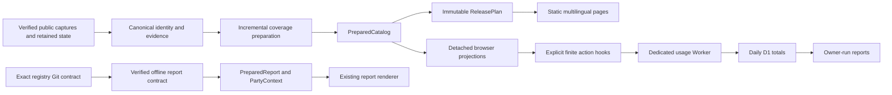

# Integrated architecture implementation

The implementation starts at registry `67e377dc2a5a095e2fe05b331235fb679895a4bd` (merged Maishift PR #42) and report `c4992ce14e3b5a0821e96a801c8cf925f60f41cf` (PR #21). The canonical working copies are preserved. The linked implementation checkouts are `C:\Dev\worktrees\maimai-architecture-registry` and `C:\Dev\worktrees\maimai-architecture-report`.

This is an implemented local review candidate. It is not a production release: retaining all historical URLs and adding the complete multilingual corpus requires 29,049 files, above the existing 20,000-file guard. Account configuration, capacity, privacy review and combined activation remain explicit release gates.

## Architecture assessment and resulting boundaries

The existing static-site model, canonical catalog identities, independently versioned report consumer and browser-local personal data remain sound foundations. The maintenance problems were dependencies crossing those boundaries: library code importing owner scripts, publication extracting application data from rendered HTML, regional display mutating accepted catalog objects, provider matching mixed with DOM/storage orchestration, and release construction writing files while still deciding what to publish.

The refactor introduces narrow preparation and domain interfaces while preserving existing presentation and protocols:

- **Preparation:** `PreparedCatalog` supplies HTML and publication directly. `PreparedReport` separates preparation from unchanged HTML assembly. Parser, transcription identity and count logic live in the installable library; script entry points retain compatibility facades.
- **Identity and coverage:** durable song-owned artwork, title classification and provider reconciliation are independent of analysis availability. Immutable provider captures, scoped acceptance, bounded queues, reason-specific retry state and receipt-bound replay make progress reproducible. Existing identities, history and provenance remain authoritative.
- **Browser domains:** pinned TypeScript modules own provider indexing, import-generation invalidation, regional projections and the usage contract. Existing DOM/storage adapters consume them. Canonical data stays unchanged when display region changes.
- **Publication:** `plan_public_release()` returns immutable verified bytes and a capacity decision before writing. Historical startup/detail references are validated and retained; shared detail shards are additive. A fresh-directory writer exposes the final manifest last. Over-capacity review bundles intentionally omit a deployable manifest.
- **Observability:** explicit action hooks submit finite broad categories to a separate Worker. No URL, search, chart identifier, player data, raw error or visitor/session identifier enters its data contract. Daily totals and an explicit coverage ledger support owner reports without inventing users, funnels or observed zeroes.

The refactor deliberately retains the existing static deployment model and visual components. It does not introduce a frontend framework, runtime server rendering, player schema migration or Node requirement for Python installs/offline reports. Typed build dependencies are pinned and build-only; source distributions preserve the complete package asset bytes.

## Integrated functionality

The original handoffs and accepted amendments in `handoffs/` remain the scope record. The implemented coverage stage runs through supported source, accepted-package, metadata-only and refresh preparation. Offline reuse makes no network calls; replay uses bound captures and selections. `policy_exact` is accepted only for the appropriate provider contract. Maishift evidence does not grant Kamaitachi authority.

Song/version pages use stable persisted routes, canonical identities, four explicit languages, regional metadata/artwork and translated initial HTML. Existing chart clicks still expand inline. The separate song-page link retains the mounted browser; history snapshots contain browser controls and public identities, never copies of scores. Direct arrivals retain ordinary working browser links, and version pages progressively initialize the existing UI.

The first-party collector replaces the Cloudflare Web Analytics browser beacon at combined launch. Optional GA remains separate. GPC/DNT, preview suppression, independent client/server kills, bounded in-memory buffering and best-effort delivery are implemented. D1 retains New York daily totals indefinitely. JSON, Markdown, totals CSV and coverage CSV distinguish measured zero from unknown/partial periods and display UTC boundaries.

## Evidence and review entry points

- [Coverage evidence](COVERAGE_VALIDATION.md): actual 7,251-chart / 1,694-song bounded run, 18 additional song jackets, no removals, retained mappings, repeat/offline/replay/package evidence and source failures.
- [Acceptance checklist](VALIDATION.md): complete scope reconciliation, test results, exact retained outputs and outstanding release gates.
- [Performance evidence](PERFORMANCE.md): controlled repeated baseline/SEO/usage measurements and their limitations.
- [Usage configuration and reports](../../usage-worker/README.md): disabled local config, finite collection contract, owner commands and combined activation requirements.
- [Registry/report contract](../PUBLIC_CONTRACTS.md): exact Git objects and offline consumption.

Production is unchanged. No push, merge, deployment, private-report access, credential operation, schedule, database provisioning or protected account change was performed. Copied unpublished development-layout/retention work from other tasks is excluded from the product commits; its canonical originals are preserved.